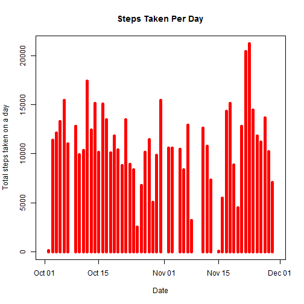
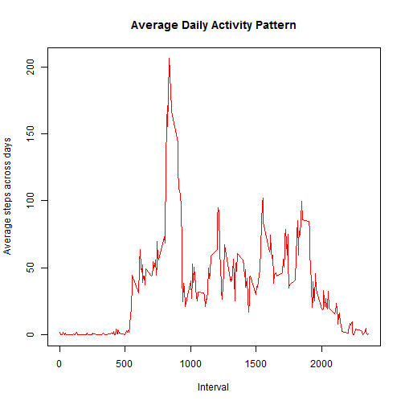
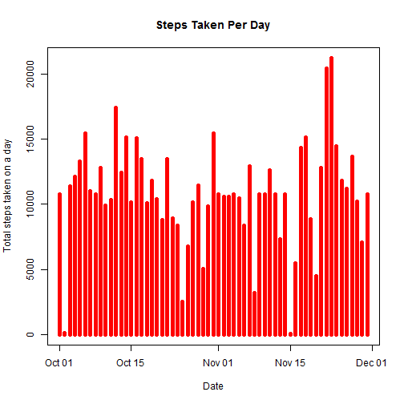

# Reproducible Research: Peer Assessment 1

## Introduction
It is now possible to collect a large amount of data about personal movement 
using activity monitoring devices. These type of devices take measurements about 
their users regularly to improve their health and to find patterns in their behavior. 
But these data remain under-utilized both because the raw data are hard to obtain 
and there is a lack of statistical methods and software for processing and 
interpreting the data.

This assignment makes use of data from a personal activity monitoring device. 
This device collects data at 5-minute intervals through out the day. The data 
consists of two months of data from an anonymous individual collected during the 
months of October and November, 2012 and include the number of steps taken in 
5-minute intervals each day.


## Loading and preprocessing the data
The dataset is available at [Activity Monitoring Data](https://d396qusza40orc.cloudfront.net/repdata%2Fdata%2Factivity.zip) in a zip archive. Assuming that the latest version of the data is downloaded 
and is present in the current directory, we'll extract the contents of the archive, 
read the data into a table and tidy it up for analysis.


```r
unzip("activity.zip")
activity <- read.csv("activity.csv", header = TRUE, colClasses = c("numeric", 
    "Date", "numeric"))
```


## What is mean total number of steps taken per day?
To compute this, we first sum up the total number of steps for each day
(discounting NA values).  
We shall use the "plyr" package for summarizing the data.

```r
library(plyr)
dateWiseActivity <- ddply(activity, .(date), summarize, steps = sum(steps))
```


### Steps Per Day - Histogram
Histogram of the total number of steps taken each day:

```r
plot(dateWiseActivity$date, dateWiseActivity$steps, type = "h", col = "red", 
    lwd = 5, xlab = "Date", ylab = "Total steps taken on a day", main = "Steps Taken Per Day")
```

 


### Steps Per Day - Averages
The **mean** and **median** total number of steps taken per day:


```r
stepsMean <- mean(dateWiseActivity$steps, na.rm = TRUE)
stepsMedian <- median(dateWiseActivity$steps, na.rm = TRUE)
```

The **mean** total number of steps per day is **1.0766 &times; 10<sup>4</sup>**.  
The **median** total number of steps per day is **10765**.


## What is the average daily activity pattern?

### Average Daily Activity Pattern - Plot
Time series plot of the 5-minute interval and the average number of steps taken,
averaged across all days is as shown below.  
NOTE: There are *jumps* in this plot on the x-axis as the time interval goes from
55 min of current hour to 0 min of next hour.


```r
intervalActivity <- aggregate(list(steps = activity$steps), list(interval = activity$interval), 
    mean, na.rm = TRUE)

plot(intervalActivity$interval, intervalActivity$steps, type = "l", col = "red", 
    xlab = "Interval", ylab = "Average steps across days", main = "Average Daily Activity Pattern")
```

 


### Average Daily Activity Pattern - Maximum
Which 5-minute interval, on average across all the days in the dataset, 
contains the maximum number of steps?


```r
maxVal <- max(intervalActivity$steps)
intervalVal <- intervalActivity[intervalActivity$steps == maxVal, ]$interval
```

The 5-minute interval containing the **maximum** number of steps 
is **08:35**.


## Imputing missing values

### Missing Values Count
Create a table without the missing values and subtract observation count 
from original table to get the missing value count.


```r
activityComplete <- activity[complete.cases(activity), ]
missingVals <- nrow(activity) - nrow(activityComplete)
```

Total number of missing rows in the dataset is **2304**.

### Strategy for Filling Missing Values
We shall use the 5-minute mean across all days to substitute each missing step data.  
This way, we'll be able to closely model our data with the real-world observations.
We have already computed the 5-minute means above.


```r
str(intervalActivity$steps)
```

 num [1:288] 1.717 0.3396 0.1321 0.1509 0.0755 ...


### Create New Dataset with Missing Values Filled
Create a copy of the activity table.  
Copy the 5-minute means into the new activity table wherever we have missing values.


```r
newActivity <- activity
newActivity$steps[is.na(newActivity$steps)] <- intervalActivity$steps
```


### Compare with Original Data
Plot a histogram of the new data with missing values filled.


```r
dateWiseActivityNew <- ddply(newActivity, .(date), summarize, steps = sum(steps))

plot(dateWiseActivityNew$date, dateWiseActivityNew$steps, type = "h", col = "red", 
    lwd = 5, xlab = "Date", ylab = "Total steps taken on a day", main = "Steps Taken Per Day")
```

 

This histogram looks much more filled due to the new values.  

Compute mean and median total number of steps taken per day for new data.


```r
stepsMeanNew <- mean(dateWiseActivityNew$steps)
stepsMedianNew <- median(dateWiseActivityNew$steps)
```

The **mean** total number of steps per day for new data is **1.0766 &times; 10<sup>4</sup>**.  
The **median** total number of steps per day for new data is **10766**.

Impact of imputing missing data:
- The mean and median of the new data are approximately equal to those computed 
in the first part of the assignment. (There is an error of only 0.1.)
- This shows that if we add missing values to the data which are its averages, 
there is no change to the resulting averages of the new data.
- Similarly, had we chosen our missing value replacement strategy as filling 
in mean/median of steps per day, the above averages would have remained unaffected.


## Are there differences in activity patterns between weekdays and weekends?

### Segregate Weekdays and Weekends
To separate the weekdays and weekends, add a factor column "day" to the 
dataset and by creating a condition vector, use it to subset and modify the dataset.


```r
isWeekend <- weekdays(newActivity$date) == "Saturday" | weekdays(newActivity$date) == 
    "Sunday"
newActivity$day[isWeekend] <- "weekend"
newActivity$day[!isWeekend] <- "weekday"
```


### Time Series Plot - Weekend v/s Weekdays
We require the "lattice" package for this plot.  
We summarize the new data taking the average number of steps for the
5-minute intervals, segregated by weekdays/weekends and plot them in
a contrasting manner to show activity pattern.


```r
library(lattice)
activityPattern <- ddply(newActivity, .(day, interval), summarize, steps = mean(steps))
xyplot(steps ~ interval | day, data = activityPattern, layout = c(1, 2), type = "l", 
    xlab = "Interval", ylab = "Number of steps")
```

 

